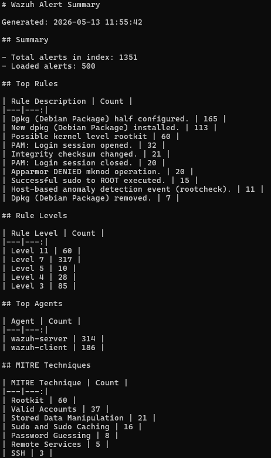

# Python Wazuh Alert Analyzer

## Projektbeschreibung

Dieses Projekt ist ein kleines Python-Lernprojekt im Bereich Cybersecurity.

Das Skript verbindet sich mit dem **Wazuh Indexer**, liest Security Alerts aus den `wazuh-alerts-*`-Indizes aus und erstellt daraus eine einfache Zusammenfassung.

Das Projekt baut auf meinem lokalen **Wazuh SIEM Lab** auf. Ziel war es, erste praktische Erfahrungen mit Alert-Auswertung, JSON-Verarbeitung und einfacher Security-Monitoring-Automatisierung mit Python zu sammeln.

---

## Ziel des Projekts

Ziel war es, ein Python-Skript zu entwickeln, das Wazuh Security Alerts ausliest und übersichtlich zusammenfasst.

Umgesetzt wurden:

- Verbindung zum Wazuh Indexer
- Authentifizierung mit Indexer-Zugangsdaten
- Abfrage der `wazuh-alerts-*`-Indizes
- Auswertung der geladenen Alerts
- Anzeige der häufigsten Regeln
- Anzeige der Rule Levels
- Anzeige der aktivsten Agents
- Anzeige erkannter MITRE-Techniken
- Erstellung eines Markdown-Reports
- Nutzung einer lokalen `.env`-Datei für sensible Zugangsdaten

---

## Verwendete Technologien

| Komponente | Technologie |
|---|---|
| Programmiersprache | Python 3.12 |
| API-Zugriff | requests |
| Umgebungsvariablen | python-dotenv |
| HTTPS-Warnungen | urllib3 |
| SIEM-System | Wazuh |
| Datenquelle | Wazuh Indexer |
| Betriebssystem | Windows 11 |
| Testumgebung | Lokales Wazuh SIEM Lab |
| Verbindung | SSH-Tunnel zum Wazuh Indexer |

---

## Projektstruktur

```text
python-wazuh-alert-analyzer/
├── src/
│   └── main.py
├── docs/
│   └── example-wazuh-alert-summary.md
├── screenshots/
│   └── python-wazuh-alert-summary-output.png
├── .env.example
├── .gitignore
├── README.md
└── requirements.txt
```

---

## Sicherheit

Die echten Zugangsdaten werden lokal in einer `.env`-Datei gespeichert.

Diese Datei wird **nicht** auf GitHub hochgeladen.

Die Datei `.env.example` dient nur als Vorlage:

```env
WAZUH_INDEXER_URL=https://127.0.0.1:9200
WAZUH_INDEXER_USER=your_indexer_user
WAZUH_INDEXER_PASSWORD=your_indexer_password
VERIFY_SSL=false
ALERT_INDEX=wazuh-alerts-*
ALERT_LIMIT=500
```

Die echte `.env` bleibt lokal und ist in der `.gitignore` ausgeschlossen.

---

## Funktionsweise

Das Skript führt folgende Schritte aus:

1. `.env`-Datei laden
2. Verbindung zum Wazuh Indexer herstellen
3. Authentifizierung durchführen
4. Alerts aus `wazuh-alerts-*` abrufen
5. Alerts nach `@timestamp` sortieren
6. Die neuesten Alerts analysieren
7. Top Rules zählen
8. Rule Levels zählen
9. Top Agents zählen
10. MITRE-Techniken zählen
11. Markdown-Report im Ordner `reports` erzeugen

---

## Beispielausgabe

```text
Connecting to Wazuh Indexer...
Alert index: wazuh-alerts-*
Alert limit: 500

Wazuh Alert Summary
===================
Total alerts in index: 1351
Loaded alerts:         500

Top Rules
---------
- Dpkg (Debian Package) half configured.: 165
- New dpkg (Debian Package) installed.: 113
- Possible kernel level rootkit: 60
- PAM: Login session opened.: 32
- Integrity checksum changed.: 21
- PAM: Login session closed.: 20
- Apparmor DENIED mknod operation.: 20
- Successful sudo to ROOT executed.: 15

Rule Levels
-----------
- Level 11: 60
- Level 7: 317
- Level 5: 10
- Level 4: 28
- Level 3: 85

Top Agents
----------
- wazuh-server: 314
- wazuh-client: 186

MITRE Techniques
----------------
- Rootkit: 60
- Valid Accounts: 37
- Stored Data Manipulation: 21
- Sudo and Sudo Caching: 16
- Password Guessing: 8
- Remote Services: 5
- SSH: 3
```

---

## Screenshot



---

## Beispiel-Report

Ein Beispiel des erzeugten Reports befindet sich hier:

```text
docs/example-wazuh-alert-summary.md
```

Der Report enthält:

- Gesamtzahl der Alerts im Index
- Anzahl der geladenen Alerts
- häufigste Rule Descriptions
- Verteilung der Rule Levels
- aktivste Agents
- erkannte MITRE-Techniken

---

## Installation

Repository klonen:

```powershell
git clone https://github.com/n-somas/python-wazuh-alert-analyzer.git
```

In den Projektordner wechseln:

```powershell
cd python-wazuh-alert-analyzer
```

Virtuelle Umgebung erstellen:

```powershell
python -m venv .venv
```

Virtuelle Umgebung aktivieren:

```powershell
.\.venv\Scripts\Activate.ps1
```

Abhängigkeiten installieren:

```powershell
pip install -r requirements.txt
```

---

## Konfiguration

Vor der Ausführung muss lokal eine `.env`-Datei angelegt werden.

Dafür kann die Beispiel-Datei als Vorlage genutzt werden:

```powershell
copy .env.example .env
```

Danach müssen die Werte in der `.env` angepasst werden:

```env
WAZUH_INDEXER_URL=https://127.0.0.1:9200
WAZUH_INDEXER_USER=your_indexer_user
WAZUH_INDEXER_PASSWORD=your_indexer_password
VERIFY_SSL=false
ALERT_INDEX=wazuh-alerts-*
ALERT_LIMIT=500
```

---

## SSH-Tunnel zum Wazuh Indexer

In meiner lokalen Testumgebung war der Wazuh Indexer nicht direkt vom Windows-Host erreichbar. Deshalb wurde ein SSH-Tunnel verwendet.

Beispiel:

```powershell
ssh -L 9200:localhost:9200 nilo@192.168.56.101
```

Danach kann das Python-Skript über folgende lokale Adresse auf den Wazuh Indexer zugreifen:

```text
https://127.0.0.1:9200
```

---

## Ausführung

Das Skript wird mit folgendem Befehl gestartet:

```powershell
python src\main.py
```

---

## Ergebnis

Das Skript konnte erfolgreich eine Verbindung zum Wazuh Indexer herstellen und Alerts aus den `wazuh-alerts-*`-Indizes auslesen.

In der Testumgebung wurden insgesamt **1351 Alerts** gefunden. Davon wurden die neuesten **500 Alerts** geladen und ausgewertet.

Beispielhafte Ergebnisse:

| Kategorie | Ergebnis |
|---|---|
| Total alerts | 1351 |
| Loaded alerts | 500 |
| Top Agent | wazuh-server |
| Zweiter Agent | wazuh-client |
| Höchstes Rule Level im Report | Level 11 |
| Beispiel MITRE-Technik | Sudo and Sudo Caching |

---

## Hinweis zu Alerts

Ein Alert wie `Possible kernel level rootkit` bedeutet nicht automatisch, dass das System tatsächlich kompromittiert ist.

Solche Alerts müssen immer geprüft und im Kontext bewertet werden. In diesem Projekt dient der Alert als Beispiel dafür, dass das Skript Wazuh-Alerts auslesen, zählen und strukturiert darstellen kann.

---

## Gelernte Inhalte

Durch dieses Projekt wurden folgende Grundlagen praktisch geübt:

- Python-Projektstruktur
- Virtuelle Python-Umgebung
- Arbeiten mit externen Bibliotheken
- API-Zugriff mit `requests`
- Authentifizierung gegen den Wazuh Indexer
- Nutzung von `.env`-Dateien
- JSON-Verarbeitung
- Zählen und Gruppieren von Alert-Daten
- Arbeiten mit `Counter`
- Markdown-Report-Erstellung
- Erste Automatisierung im Security-Monitoring-Umfeld

---

## Hinweis

Dieses Projekt ist ein lokales Lernprojekt.

Es enthält keine produktiven Zugangsdaten, keine Unternehmensdaten und keine sensiblen Informationen.
